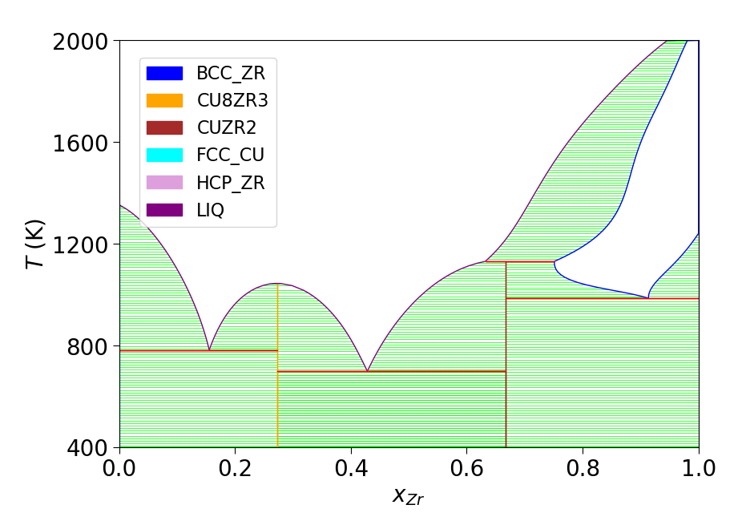

# Summary
Exa-PD is a highly parallelizable workflow for constructing multi-element phase diagrams (PDs). It uses standard sampling techniques—molecular dynamics (MD) and Monte Carlo (MC)—as implemented in the LAMMPS package, to simultaneously sample multiple phases on a fine temperature–composition mesh for free-energy calculations. The workflow uses Parsl as a global controller to manage the MD/MC jobs to achieve massive parallelization with almost ideal scalability. The resulting free energies of both liquid and solid phases (including solid solutions) are then fed to CALPHAD modeling using the PYCALPHAD package for the construction of a multi-element PD.

{ width=80%}

# Statement of Need

# Acknowledgements
This work was supported by the U.S. Department of Energy (DOE), Office of Science, Basic Energy Sciences, Materials Science and Engineering Division through the Computational Material Science Center program. Ames National Laboratory is operated for the U.S. DOE by Iowa State University under contract # DE-AC02-07CH11358. Los Alamos National Laboratory is operated by Triad National Security, LLC, for the National Nuclear Security Administration of U.S. Department of Energy under Contract No. 89233218CNA000001.

This research used resources provided by the National Energy Research Scientific Computing Center, supported by the Office of Science of the U.S. Department of Energy under Contract No. DE-AC02-05CH11231, and resources provided by the Los Alamos National Laboratory Institutional Computing Program.

# References
